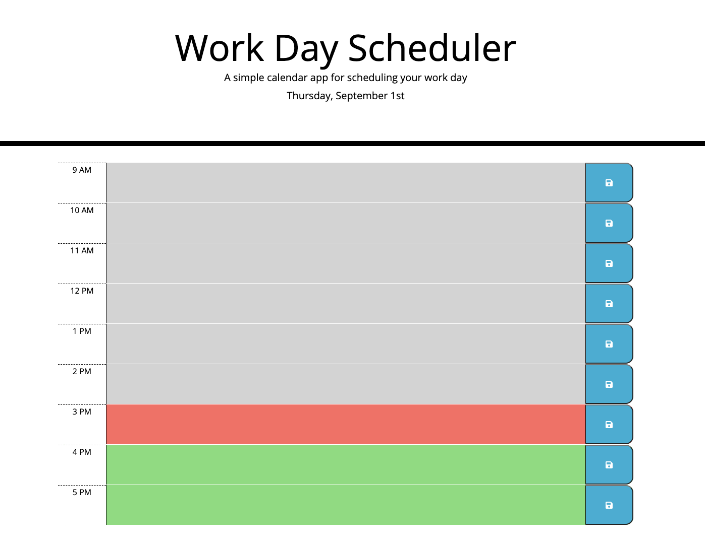
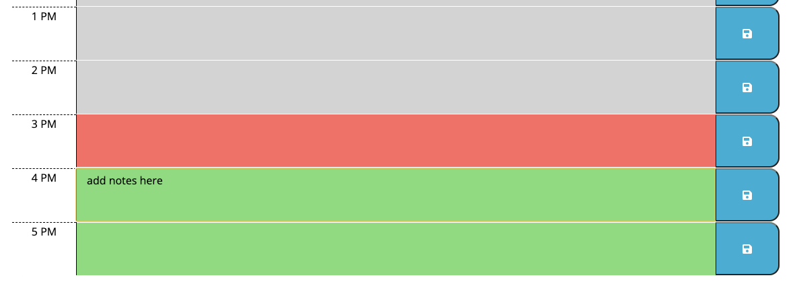

# Simple-Work-Day-Scheduler

## Description

This scheduler is a simple work day scheduler that lets you add notes to each working hours. This will help you manage your time and priorities throughout the day. It is also color coded to remind you what time it is. This project was built to practice using third-party API Libraries. The API that I have utilised here are: jQuery and MomentJS. These libraries simplifies the way we code using Java Script. In creating this project, I've learned to utilize third party Libraries to simplify my coding workflow and how to research the ways to use different API's in the future.

Link to GitHub Page: https://mecuboi.github.io/work-day-scheduler/

## Installation

- Firstly I git cloned the repo from GitHub to my local computer
- Then use the existing code that had been provided for HTML and CSS.
- Then I use jQuery's DOM manipulation along with for loop function to create the time-block in HTML along with jQuery's Column sizing
- I was also able to use momentJS to display the current day and month
- Then in the script.js file, I continue on creating a logic within the for loop to identify whether the timeblock is showing the current hour, past hour or future hour.
- Then create a function on saving the description on the local storage of the browser so that the notes doesn't disappear.
- Finally create a function to render the notes from the local storage each time the page is reloaded.

## Usage

Here is how the homepage will look like:

You will be greeted with the time and 3 different color blocks:
- grey for past hour
- red for present hour
- green for future hour

you can easily add notes/description in the colored block like below:

and click on the blue save icon to make sure that your reminder does not disappear if the page is refreshed.

## Credits

- jQuery
- momentJS
- https://developer.mozilla.org/en-US/

## License

